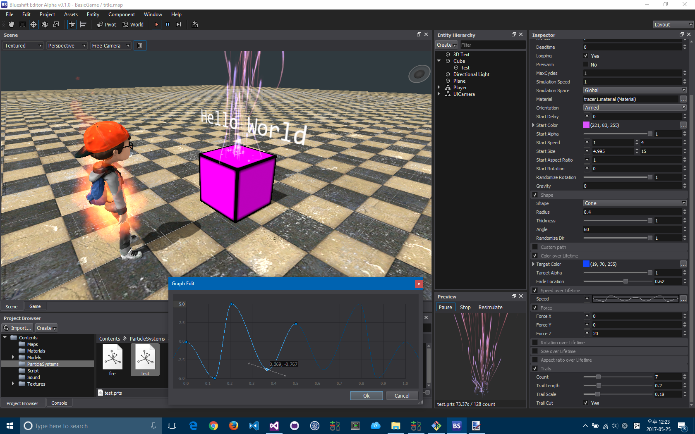
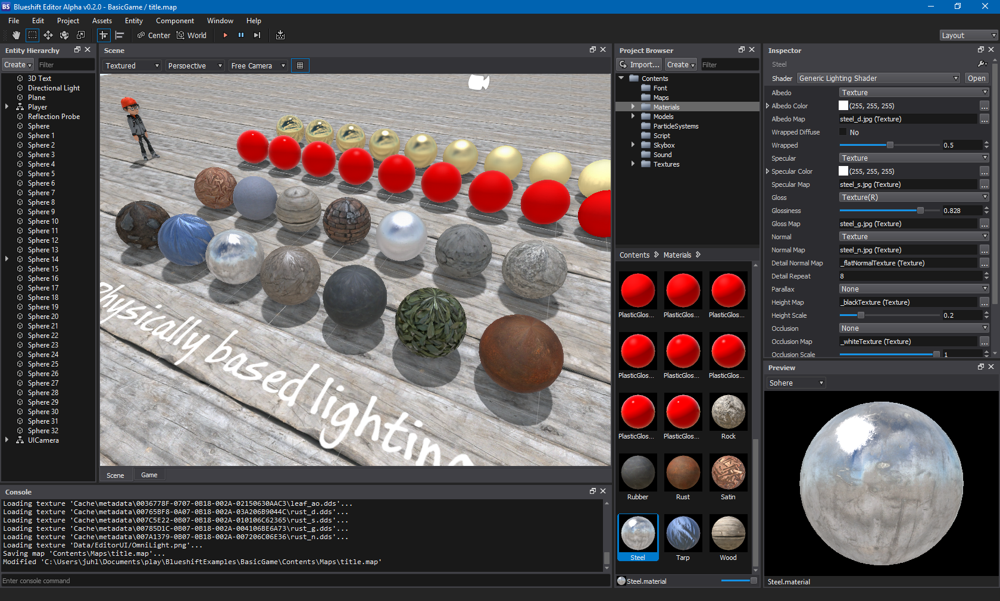

Blueshift Game Engine
=======================

Blueshift is a cross-platform 3D game engine implemented in C++. it's free, open-source, and works on Windows, macOS, iOS, and Android.
The project is currently in an early stage of development.

See the [change log](CHANGELOG.md) for changes.

Features
-------------------

  * Cross-platform (Windows, macOS, iOS and Android)
  * OpenGL 3.2+, OpenGL ES 3.0 rendering
  * Skeletal (with hardware skinning) animation
  * GPU instancing with skinned mesh
  * Parametric animation blending
  * Directional, spot, point lights
  * Shadow mapping (cascaded shadow map, omni directional shadow map, projected shadow map)
  * Particle system
  * Post-processing
  * PBR rendering
  * Physics using [Bullet](http://www.bulletphysics.org/)
  * Vehicle physics
  * Scripting using [Lua](https://www.lua.org/) and [LuaJIT](https://luajit.org/)
  * Audio static/streaming playback using DirectSound, [OpenAL](https://www.openal.org/) and OpenSLES
  * TrueType font rendering using [FreeType](https://www.freetype.org/)
  * Component based scene objects
  * Playable WYSIWYG editor using [Qt](https://www.qt.io/) with undo & redo capabilities

Downloads
-------------------

Blueshift editor binaries are downloadable [here](https://github.com/PolygonTek/BlueshiftEngine/releases).

Examples
-------------------

Example projects are downloadable [here](https://github.com/PolygonTek/BlueshiftExamples/archive/master.zip).

Screenshots
-------------------

Documentation
-------------------

* [How to Build Engine Runtime Libraries](https://github.com/PolygonTek/BlueshiftEngine/wiki/How-to-Build-Engine-Runtime-Libraries)
* [Lua Debugging with ZeroBrane Studio](https://github.com/PolygonTek/BlueshiftEngine/wiki/Lua-Debugging-with-ZeroBrane-Studio)

License
-------------------

The Blueshift game engine source code is released under the Apache 2.0 license. Please see [LICENSE.md](LICENSE.md) for complete licensing information.

How To Contribute
-------------------

Contributions are always welcome, either reporting issues/bugs or forking the repository and then issuing pull requests when you have completed some additional coding that you feel will be beneficial to the main project. If you are interested in contributing in a more dedicated capacity, then please contact me.

See also
-------------------

[Blueshift Document](https://github.com/PolygonTek/BlueshiftDocument/blob/master/README.md)

