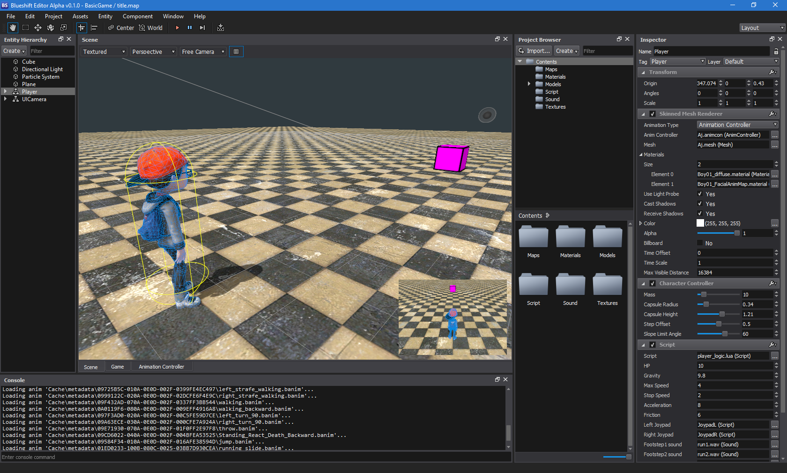
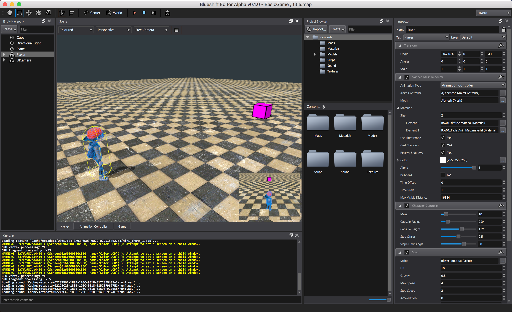

Blueshift Game Engine
=======================

Blueshift is a cross-platform 3D game engine. it's free, open-source, and works on Windows, macOS, iOS, and Android.
The project is currently in an early stage of development.

Downloads
-------------------

Blueshift editor binaries are downloadable [here](https://github.com/PolygonTek/BlueshiftEngine/releases).

Screenshots
-------------------

How To Build Engine
-------------------

You can build Blueshift Engine but Blueshift Editor is **not** open source yet.

**Please note**: Building from source code is intended for users who want to use/test new features or customize the C++ source code. For most users, we recommend the [binary releases](https://github.com/PolygonTek/BlueshiftEngine/releases).

## Windows (64 bit) and Android

### Prerequisite

  * [MS Visual Studio 2015](https://www.visualstudio.com/downloads/)
  * [CMake](https://cmake.org/download/)

### Instruction

  1. Clone the repository `git clone --recursive --progress https://github.com/PolygonTek/BlueshiftEngine.git`

  2. Run `Scripts\Copy-EngineData.bat` to copy essential data to the engine folder.

  3. Run `Scripts\Build-Win64.bat` to build engine from the sources.

## macOS and iOS

### Prerequisite

  * Xcode
  * [CMake](https://cmake.org/download/)

### Instruction

  1. Clone the repository `git clone --recursive --progress https://github.com/PolygonTek/BlueshiftEngine.git`

  2. Run `Scripts/Copy-EngineData.command` to copy essential data to the engine folder.

  3. Run `Scripts/Build-macOS.command` to build engine for macOS from the sources.

  4. Run `Scripts/Build-iOS.command` to build engine for iOS from the sources.

License
-------------------

The Blueshift game engine source code is released under the Apache 2.0 license. Please see [LICENSE.md](LICENSE.md) for complete licensing information.

How To Contribute
-------------------

Contributions are always welcome, either reporting issues/bugs or forking the repository and then issuing pull requests when you have completed some additional coding that you feel will be beneficial to the main project. If you are interested in contributing in a more dedicated capacity, then please contact me.

See also
-------------------

[Blueshift Document](https://github.com/PolygonTek/BlueshiftDocument/blob/master/README.md)

